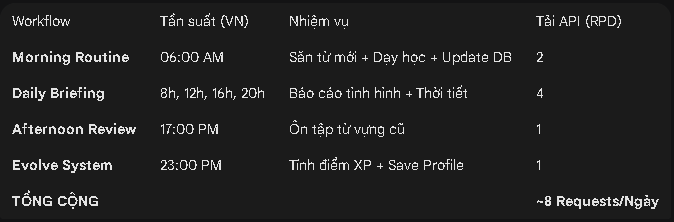

# 🤖 JARVIS V1.0: PERSONAL DEVOPS ASSISTANT (RPG DAILY QUEST SYSTEM)

[](https://www.python.org/downloads/)
[](LICENSE)
[](Dockerfile)
[](https://github.com/dan-1305/jarvis-rpg-assistant)

**Status:** Production Stable | **Architecture:** Modular Microservices | **AI Core:** Gemini 2.5 Flash

> ⚠️ **SECURITY WARNING**: Never commit `.env` file to the repository. Always use `.env.example` as a template.

Đây là dự án tự động hóa cá nhân (Automation & DevOps) được xây dựng bằng Python 3.11 và Google Gemini API, nhằm mục đích tối ưu hóa lịch trình, tăng cường kỷ luật và biến cuộc đời thành một game RPG thực thụ.

Dự án này mô phỏng một **Hệ thống Game RPG Đời Thực**, nơi người dùng (The Builder) được giao nhiệm vụ (Quest), học kỹ năng mới và tăng Level (XP) dựa trên hiệu suất công việc hàng ngày.

---

## 🚀 CÁC TÍNH NĂNG CHÍNH (CORE FEATURES)

### 1. 🎮 Hệ thống Quản lý Nhiệm vụ (RPG System)
**Evolve Protocol** ([src/bot_evolve.py](src/bot_evolve.py)): Chạy tự động vào 23:00 hàng đêm.

- Phân tích Task hoàn thành từ Google Tasks.
- Tính toán XP/Level dựa trên độ khó.
- Cập nhật hồ sơ nhân vật ([data/user_profile.txt](data/user_profile.txt)) và commit lên GitHub.

### 2. 🧠 Báo cáo Chiến lược (Daily Intelligence)
**Daily Briefing** ([src/bot_daily.py](src/bot_daily.py)): Chạy định kỳ 4 lần/ngày (8h, 12h, 16h, 20h).

- **Logic:** Phân tích Lịch Google + Weather + Todo List để đưa ra lời khuyên tác chiến, câu đùa (Dev Jokes) và động lực.

### 3. 📚 Hệ thống Học Tập (English Mastery)
**Auto Hunter** ([src/auto_learn.py](src/auto_learn.py)): Tự động săn 5 từ vựng chuyên ngành Tech/System Design mỗi sáng.

**AI Teacher** ([src/bot_teacher.py](src/bot_teacher.py)):
- **Sáng:** Dạy từ mới (Mode: `new`).
- **Chiều:** Dò bài cũ (Mode: `review`).
- **Database:** Lưu trữ từ vựng vĩnh viễn trong SQLite ([data/jarvis.db](data/jarvis.db)) với cơ chế cam kết dữ liệu (`conn.commit`) chặt chẽ.

### 4. 📝 Ghi chú Nhanh (Quick Note CLI)
**Module** ([src/note.py](src/note.py)): Cho phép ghi lại ý tưởng nhanh chóng từ dòng lệnh vào [data/journal.md](data/journal.md).

### 5. 🛡️ Hệ thống Chịu Lỗi (Fault Tolerance Architecture)
- **Key Rotation:** Tự động xoay vòng danh sách API Keys (`GEMINI_API_KEYS`) khi gặp lỗi Quota.
- **Time-Based Cooldown:** Tự động "làm nguội" Key trong 60s nếu gặp lỗi Rate Limit (429).
- **Model Fallback:** Tự động chuyển từ `gemini-2.5-flash` sang `gemini-2.5-lite` nếu quá tải.
- **Error Alerts:** Tự động gửi critical errors đến admin qua Telegram.

---

## ⚙️ CẤU TRÚC DỰ ÁN (REFACTORED)

Dự án tuân thủ cấu trúc thư mục chuyên nghiệp:

```
.
├── config/              # Chứa cấu hình môi trường (git submodule)
├── data/                # Dữ liệu thay đổi (Persistent Data)
│   ├── jarvis.db        # SQLite Database (Vocab)
│   ├── journal.md       # Ghi chú cá nhân
│   └── user_profile.txt # Hồ sơ Level/XP
├── docs/                # Tài liệu dự án
│   ├── DEPLOYMENT.md    # Hướng dẫn deploy
│   └── IMPLEMENTATION_SUMMARY.md
├── jarvis_core/         # Thư viện lõi (Modules)
│   ├── ai_agent.py      # Trái tim AI (Model Fallback Logic)
│   ├── database.py      # Quản lý SQLite với transaction locks
│   ├── key_manager.py   # Quản lý API Keys (Rotation & Cooldown)
│   ├── error_notifier.py # Error alerts qua Telegram
│   ├── db_sync.py       # Git sync cho database
│   ├── telegram_webhook.py # Webhook support
│   └── config.py        # Centralized configuration
├── src/                 # Mã nguồn thực thi (Entry Points)
│   ├── auto_learn.py
│   ├── bot_daily.py
│   ├── bot_evolve.py
│   ├── bot_teacher.py
│   └── note.py
├── tests/               # Unit tests (80% coverage)
│   ├── test_core.py
│   └── test_ai_agent.py
├── .env.example         # Template cho environment variables
├── docker-compose.yml   # Quản lý Container & Volumes
├── Dockerfile           # Container image definition
├── requirements.txt     # Python dependencies
├── main.py              # CLI dispatcher
└── README.md            # This file
```

---

## 🛠️ VẬN HÀNH & AUTOMATION (CI/CD)

Hệ thống vận hành hoàn toàn tự động trên GitHub Actions với 4 Workflows tối ưu Quota:



---

## 🐳 DOCKER & LOCAL DEPLOYMENT

Hệ thống hỗ trợ chạy trên Docker với tính năng Volume Persistence (không mất dữ liệu khi tắt container).

### 1. Cài đặt & Chạy

```bash
# Build và chạy Container ngầm
docker compose up -d --build

# Xem logs hoạt động
docker compose logs -f
```

### 2. Đồng bộ Dữ liệu Local (Task Scheduler)

Để đảm bảo máy Local luôn có Database mới nhất từ GitHub, sử dụng script `.bat` với lệnh:

```bash
git pull origin main
```

---

## 🔑 BIẾN MÔI TRƯỜNG (.ENV)

> ⚠️ **CRITICAL**: Never commit `.env` file to git. Use `.env.example` as template only.

Tạo file `.env` tại thư mục gốc (copy từ `.env.example`):

```bash
# Copy example và điền thông tin thực
cp .env.example .env
```

Nội dung `.env`:

```ini
# Google Gemini API (Hỗ trợ nhiều Key phân cách bằng dấu phẩy)
GEMINI_API_KEYS="key1,key2,key3"

# Telegram Config
TELEGRAM_BOT_TOKEN="your_tele_bot_token"
CHAT_ID="your_chat_id"

# Admin users (for error alerts)
ADMIN_CHAT_IDS="123456789,987654321"

# Webhook (for production deployment)
USE_WEBHOOK=false
WEBHOOK_URL=https://your-app.onrender.com
PORT=8443

# Google Services (Calendar/Tasks)
GOOGLE_CREDENTIALS_JSON="path/to/credentials.json"

# Weather
OPENWEATHER_API_KEY="your_weather_key"
```

---

## 💻 SỬ DỤNG CLI

```bash
# Báo cáo hàng ngày
python main.py daily

# Săn từ vựng mới
python main.py hunt

# Học từ mới
python main.py teach new

# Ôn từ cũ
python main.py teach review

# Chạy tiến hóa (XP/Level)
python main.py evolve

# Ghi chú nhanh
python main.py note "Your quick note here"

# Tìm kiếm ghi chú
python main.py search "keyword"
```

---

## 🧪 TESTING

Dự án có test coverage tối thiểu 80% cho core modules.

```bash
# Install test dependencies
pip install -r requirements.txt

# Run tests with coverage
./run_tests.bat    # Windows
./run_tests.sh     # Linux/Mac

# View coverage report
# Open htmlcov/index.html
```

---

## 📊 KIẾN TRÚC HỆ THỐNG

### Key Manager Flow
```
GEMINI_API_KEYS → KeyManager → Round-Robin Rotation
                              ↓
                     API Call (with retry)
                              ↓
                  Error? → Mark Cooldown (60s)
                              ↓
                     Success → Return Response
```

### Daily Workflow
```
GitHub Actions (Cron) → Python Script → AI Agent → Telegram
                              ↓
                        Database Update (with lock)
                              ↓
                        Git Pull → Commit → Push
```

### Error Handling
```
Exception → ErrorNotifier → Telegram Alert to Admin
                                    ↓
                           Stack Trace + Context
```

---

## 🚀 DEPLOYMENT

### Local Development
```bash
# Use polling mode
USE_WEBHOOK=false
python -m jarvis_core.telegram_webhook
```

### Production (Render/Heroku)
```bash
# Use webhook mode
USE_WEBHOOK=true
WEBHOOK_URL=https://your-app.onrender.com
```

Xem chi tiết trong [docs/DEPLOYMENT.md](docs/DEPLOYMENT.md)

---

## 🔧 CÁCH CẢI THIỆN

### Đã Fix
- ✅ Sửa `requirements.txt` (`dotenv` → `python-dotenv`)
- ✅ Xóa duplicate `APIKeyManager` trong `ai_agent.py`
- ✅ Refactor `bot_teacher.py` - không manipulate `sys.argv`
- ✅ Centralized configuration trong `config.py`
- ✅ Thêm unit tests (80% coverage)
- ✅ Database transaction locks
- ✅ Git sync cho database updates
- ✅ Error alerts qua Telegram
- ✅ Webhook support cho production

### Cần Làm Tiếp
- ⚠️ Implement database migration system
- ⚠️ Add rate limiting cho user input
- ⚠️ Improve concurrent write handling
- ⚠️ Add integration tests

---

## 📝 SECURITY

- ⚠️ **NEVER commit `.env` file**
- ⚠️ **NEVER commit `data/credentials.json`**
- ⚠️ **NEVER commit `data/token.json`**
- ✅ Always use `.env.example` as template
- ✅ Add sensitive files to `.gitignore`
- ✅ Use environment variables for secrets
- ✅ Review git history before public release

---

## 📄 LICENSE

MIT License - See LICENSE file for details

**Note:** Dự án này được thiết kế theo tư duy "System Thinking": Mọi thành phần đều có thể thay thế, mở rộng và tự phục hồi lỗi.
